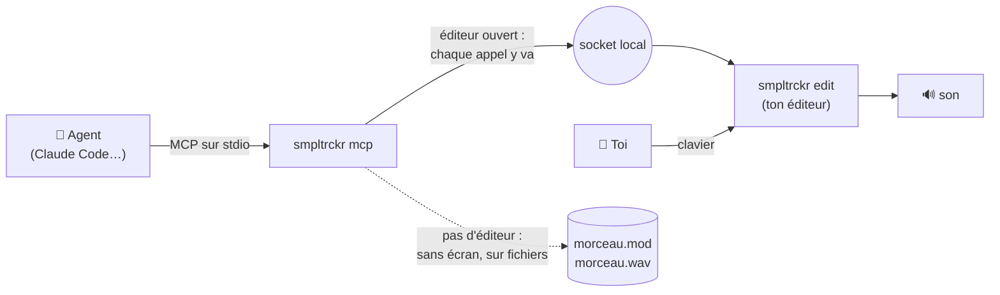
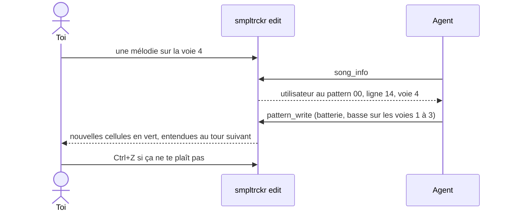
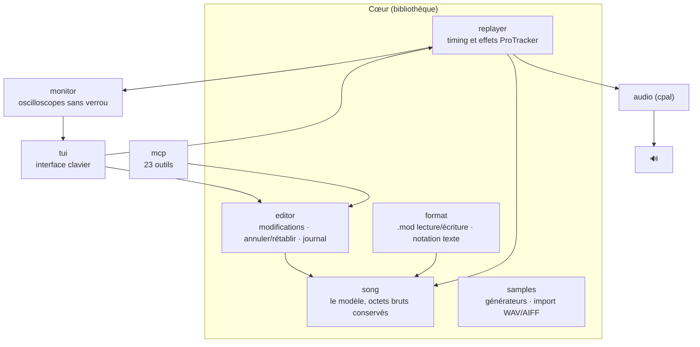

<div align="center">

```
████ █   █ ████ █     █████ ████ ████ █  █ ████
█    ██ ██ █  █ █       █   █  █ █    █ █  █  █
████ █ █ █ ████ █       █   ████ █    ██   ████
   █ █   █ █    █       █   █ █  █    █ █  █ █
████ █   █ █    ████    █   █  █ ████ █  █ █  █
```

**Un tracker façon ProTracker dans ton terminal, joué à la main ou par un agent IA.**

*Lit et écrit les `.mod` à l'octet près · son propre replayer ProTracker · oscilloscopes en Braille et
particules · un serveur MCP pour qu'un agent compose, seul ou en direct avec toi · français, anglais, japonais.*

[English](README.md) · par [@jbheren](https://github.com/jbheren)

</div>

<p align="center"></p>

<p align="center"><em>Kaze no Uta en lecture, avec la voie 3 (le koto) en solo quelques mesures.</em> <a href="docs/media/demo-fr.mp4">▶ La vidéo avec le son (MP4)</a></p>

---

## Sommaire

- [De quoi s'agit-il](#de-quoi-sagit-il)
- [Installation](#installation)
- [Premiers pas](#premiers-pas)
- [L'interface](#linterface)
- [Saisir des notes et des effets](#saisir-des-notes-et-des-effets)
- [Composer avec un agent](#composer-avec-un-agent)
- [Ligne de commande](#ligne-de-commande)
- [La notation texte](#la-notation-texte)
- [Sous le capot](#sous-le-capot)
- [Morceaux d'exemple](#morceaux-dexemple)
- [État et suite](#état-et-suite)
- [Licence](#licence)

---

## De quoi s'agit-il

smpltrckr est un tracker musical dans l'esprit de **ProTracker** sur Amiga, repensé pour le terminal.
Un morceau est une grille de **patterns** : 64 lignes, 4 voies, une note par cellule, lues de haut en bas.
Le morceau joue les patterns dans l'ordre fixé par la **liste d'ordre**.

Ce qui le distingue :

- **Le format `.mod`, fidèlement.** Un module chargé puis réenregistré est identique à l'octet près
  (vérifié sur un corpus de 49 vrais modules de The Mod Archive).
- **Son propre replayer.** Le timing et les effets de ProTracker, comparés à libopenmpt voie par voie.
- **Un agent peut jouer aussi.** smpltrckr expose 23 outils via [MCP](https://modelcontextprotocol.io) :
  un agent comme Claude peut composer un morceau entier seul, ou rejoindre le morceau que tu as ouvert
  et y travailler **avec toi, en direct**. Ses modifications s'allument à l'écran.
- **Fait pour le terminal.** Oscilloscopes en Braille sous chaque voie, particules à chaque attaque,
  couleurs reprises de ton thème [Omarchy](https://omarchy.org), dispositions de clavier (QWERTY, AZERTY, QWERTZ).

---

## Installation

### Binaire prêt à l'emploi (Linux x86_64 et ARM64)

Récupère l'archive de ta machine dans la [dernière release](https://github.com/jbheren/smpltrckr/releases/latest) :

```sh
arch=$(uname -m)        # x86_64 ou aarch64
curl -LO https://github.com/jbheren/smpltrckr/releases/download/v0.1.0/smpltrckr-v0.1.0-$arch-linux.tar.gz
tar xzf smpltrckr-v0.1.0-$arch-linux.tar.gz
install -m 755 smpltrckr-v0.1.0-$arch-linux/smpltrckr ~/.local/bin/
smpltrckr edit
```

Il a besoin de `libasound.so.2` (ALSA), présent sur pratiquement tous les Linux, y compris avec
PipeWire ou PulseAudio.

### Depuis les sources

Il faut [Rust](https://rustup.rs) (stable) et les fichiers de développement d'ALSA :

| Distribution | Commande |
|---|---|
| Debian, Ubuntu | `sudo apt install libasound2-dev pkg-config` |
| Fedora | `sudo dnf install alsa-lib-devel pkgconf` |
| Arch, Omarchy | `sudo pacman -S alsa-lib pkgconf` |

```sh
git clone https://github.com/jbheren/smpltrckr
cd smpltrckr
cargo install --path .      # installe `smpltrckr` dans ~/.cargo/bin
```

> **macOS** devrait fonctionner (le son passe par CoreAudio), mais n'a pas encore été testé.
> Windows n'est pas pris en charge pour l'instant.

---

## Premiers pas

```sh
smpltrckr edit mon-morceau.mod      # ouvrir (ou commencer) un morceau
smpltrckr play morceau.mod          # écouter, simplement
smpltrckr render morceau.mod -o morceau.wav
```

L'interface suit la langue du système ; `--lang fr` (ou `SMPLTRCKR_LANG=fr`) l'impose.

Dans l'éditeur :

1. **F7**, puis **g** : générer un son (choisis `square`), **Entrée**.
2. **F5** pour revenir au pattern, **Espace** pour le mode édition (le cadre devient rouge).
3. Joue des notes sur la rangée du bas : `w x c v b n ,` en AZERTY, `z x c v b n m` en QWERTY.
4. **Ctrl+P** boucle sur le pattern, **Échap** arrête, **Ctrl+S** enregistre.
5. **?** montre toutes les touches, **Tab** dans l'aide montre tous les effets.

---

## L'interface

```
 SMPLTRCKR  Kaze no Uta kaze-no-uta.mod  ▶  écoute   octave 2  sample 01 taiko  QWERTY  vitesse 6 · 100 BPM  ① en-tête
┌ pattern 00 ───────────────────────────────────────────────────── pos 00/04 ┐┌ ordre (F6) ──────────────────┐  ② pattern  ⑥ ordre
│   │ voie 1          │ voie 2          │ voie 3          │ voie 4           ││ 00  pattern               00 │  ③ voies
│02 │ ... .. ...      │ ... .. ...      │ ... .. A04      │ ... .. ...       ││ 01  pattern               01 │
│03 │ ... .. ...      │ ... .. ...      │ ... .. A04      │ ... .. ...       ││ 02  pattern               02 │
│04 │ ... .. ...      │ ... .. ...      │ F-2 03 ...      │ ... .. ...       ││ 03  pattern               01 │
│05 │ ... .. ...      │ ... .. ...      │ ... .. A04      │ ... .. ...       ││ 04  pattern               03 │
│06 │ ... .. ...      │ ... .. ...      │ ... .. A04      │ ... .. ...       ││                              │
│07 │ ... .. ...      │ ... .. ...      │ ... .. A04      │ ... .. ...       ││                              │
│08 │ ... .. ...      │ ... .. ...      │ A-2 03 ...      │ ... .. ...       ││                              │
│09 │ ... .. ...      │ ... .. ...      │ ... .. A04      │ ... .. ...       │└──────────────────────────────┘
│10 │ ... .. ...      │ ... .. ...      │ ... .. A04      │ ... .. ...       │┌ samples (F7) ────────────────┐  ⑦ samples
│11 │ ... .. ...      │ ... .. ...      │ ... .. A04      │ ... .. ...       ││ 01  taiko                 64 │
│12 │ ... .. ...      │ ... .. ...      │ B-2 03 ...      │ ... .. ...       ││ 02  hyoshigi              48 │
│13 │ ... .. ...      │ ... .. ...      │ ... .. A04      │ ... .. ...       ││ 03  koto                  44 │
│   │                 │                 │⣧⢸⡆⣶⢰⡆⣶⢰⡇⣼⢠⡇⣸⢀⡇⢰ │                  ││                              │  ④ oscilloscopes + particules   ⑧ master
│   │                 │                 │⣿⢸⡇⣿⢸⡇⣿⢸⡇⣿⢸⡇⣿⣸⣇⡿ │                  ││⡶⡄⢀⡶⡄⢀⣶⡀⢠⢶⡀⣠⢦ ⣰⢦ ⡴⣆ ⡴⣄⢀⡶⡄⢀⣶⡀⢠⢶│
│   │⠉⠉⠉⠉⠉⠉⠉⠉⠉⠉⠉⠉⠉⠉⠉⠉ │⠉⠉⠉⠉⠉⠉⠉⠉⠉⠉⠉⠉⠉⠉⠉⠉ │⢸⡏⣷⢻⡞⢧⠿⡼⢳⡏⣿⢹⡇⣿⢸⡇ │⠉⠉⠉⠉⠉⠉⠉⠉⠉⠉⠉⠉⠉⠉⠉⠉  ││ ⠹⠞ ⠹⠞ ⠳⠏ ⠳⠃⠈⠷⠃⠈⠿⠁⠘⠾⠁⠘⠞ ⠹⠞ ⠹⠏ │
│   │                 │                 │⠈⡇⢹ ⠇⠸ ⠇⢸ ⡇⢸⠁⡏⢸⠃ │                  ││                              │
│   │ 100 %           │ 100 %           │ 100 %           │ 100 %            ││██████▏·······················│  ⑤ état du mixage
└────────────────────────────────────────────────────────────────────────────┘└──────────────────────────────┘
Espace éditer  Entrée lire  Ctrl+P boucle  Ctrl+B tempo  Alt+1…8 couper  Alt+S solo  Alt+0 tout rétablir  ⑨ rappel des touches
F6 ordre  F7 samples  Ctrl+S enregistrer  ? aide
? : aide                                                                                              @jbheren  ⑩ état · auteur
```

| | Zone | Ce qu'elle montre |
|---|---|---|
| ① | **En-tête** | Titre et fichier (`*` = non enregistré), lecture ▶ / ■, mode **ÉDITION** ou écoute, une pastille **agent** quand un agent est connecté, octave et sample courant, disposition du clavier, vitesse et tempo. |
| ② | **Pattern** | Le pattern en cours d'édition. La ligne du curseur reste au milieu, comme dans ProTracker ; la ligne jouée est surlignée. La position dans la liste d'ordre est en haut à droite. Le cadre devient rouge en mode édition. |
| ③ | **Voies** | Quatre colonnes, une par voie. Chaque cellule se lit *note · sample · effet* (voir plus bas). |
| ④ | **Oscilloscopes** | La forme d'onde de chaque voie en points Braille, avec des particules à chaque attaque. |
| ⑤ | **État du mixage** | Le volume de chaque voie, et **coupée** ou **SOLO** le cas échéant. Une voie coupée passe en gris. |
| ⑥ | **Liste d'ordre** (F6) | Le pattern joué à chaque position du morceau. |
| ⑦ | **Samples** (F7) | Les 31 emplacements de samples, avec leur volume. |
| ⑧ | **Master** | Le mixage final : oscilloscope et niveau. |
| ⑨ | **Rappel des touches** | Les touches utiles de la zone active. Sur une colonne d'effet, l'effet sous le curseur, en clair. |
| ⑩ | **État** | Ce qui vient de se passer (enregistrement, annulation, dernière action de l'agent…), et l'auteur. |

Les couleurs suivent ton thème Omarchy quand il y en a un (et changent avec lui) ; `--theme classic`
garde les couleurs simples du terminal.

### Anatomie d'une cellule

```
 C-3 01 A04
 └┬┘ └┤ │└┴── paramètre : 2 chiffres hexadécimaux (00 à FF)
  │   │ └──── effet : 1 chiffre hexadécimal (0 à F)
  │   └────── sample : 01 à 31, en décimal  (.. = garder le sample de la voie)
  └────────── note : C-1 à B-3, # pour les dièses (C#2)  (... = pas de nouvelle note)
```

Une note sonne jusqu'à la note suivante de la même voie, ou jusqu'à la fin du sample.

### Les zones

```
          F5                    F6                    F7
   ┌──────────────┐     ┌──────────────┐     ┌──────────────┐
   │   pattern    │     │    ordre     │     │   samples    │
   │ notes, effets│     │ ← → pattern  │     │ g générer    │
   │ Espace=éditer│     │ Inser / Suppr│     │ l charger WAV│
   └──────────────┘     └──────────────┘     └──────────────┘
   les flèches, PgPréc/PgSuiv, Début/Fin se déplacent dans la zone active
```

---

## Saisir des notes et des effets

### Le clavier piano

Les notes sont aux mêmes places **physiques** que dans ProTracker et FastTracker 2, quelle que soit
la disposition : les deux rangées du bas jouent l'octave choisie, les deux du haut l'octave au-dessus.
La disposition est détectée (Hyprland, puis `localectl`) ; **F3** en change, `--keyboard` l'impose.

```
 AZERTY                                    QWERTY
   S   D       G   H   J       L   M         S   D       G   H   J       L   ;     ← dièses
 W   X   C   V   B   N   ,   ;   :   !     Z   X   C   V   B   N   M   ,   .   /   ← naturelles
 do  ré  mi  fa  sol la  si  do  ré  mi    do  ré  mi  fa  sol la  si  do  ré  mi

   é   "       (   -   è       ç   à         2   3       5   6   7       9   0     ← dièses
 A   Z   E   R   T   Y   U   I   O   P     Q   W   E   R   T   Y   U   I   O   P   ← naturelles
 do  ré  mi  fa  sol la  si  do  ré  mi    do  ré  mi  fa  sol la  si  do  ré  mi  (octave + 1)
```

- **F1 / F2** changent l'octave (1 à 3). Les notes au-dessus de B-3 n'existent pas dans ProTracker.
- **Espace** bascule entre le **mode écoute** (les notes ne font que sonner) et le **mode édition**
  (les notes s'écrivent).
- Une note jouée sonne exactement comme elle sonnera une fois écrite, sur la voie du curseur, même
  pendant la lecture.
- Dans les colonnes de sample et d'effet, on tape des chiffres et `A`–`F`. En AZERTY, la rangée des
  chiffres sans Majuscule (`& é " ' (` …) vaut des chiffres.

### Les effets

Place le curseur sur une colonne d'effet : la ligne du bas explique l'effet sous le curseur, avec ses
vraies valeurs (*« A04 : glissement de volume : baisse de 4 à chaque tick »*), ou propose la palette
des effets quand la colonne est vide. **?** puis **Tab** les montre tous.

| Effet | Ce qu'il fait | Exemple |
|---|---|---|
| `0xy` | Arpège : note, +x, +y demi-tons à chaque tick — des accords instantanés | `037` mineur, `047` majeur |
| `1xx` / `2xx` | La hauteur monte / descend de xx à chaque tick | `208` plonge |
| `3xx` | Glisse vers la note écrite, vitesse xx (la note ne redémarre pas) | `310` |
| `4xy` | Vibrato : vitesse x, profondeur y | `424` |
| `5xy` / `6xy` | Glissé / vibrato + glissement de volume | `5A0` |
| `7xy` | Trémolo | `744` |
| `9xx` | Démarre le sample à xx × 256 octets | `904` |
| `Axy` | Glissement de volume : +x, ou -y si x = 0 (fondus) | `A04` |
| `Bxx` | Saute à la position xx de la liste d'ordre | `B00` |
| `Cxx` | Volume, de 00 à 40 en hexadécimal (= 0 à 64) | `C20` = moitié |
| `Dxy` | Fin du pattern, va à la ligne xy de la position suivante | `D00` |
| `E1x` `E2x` | Hauteur +x / -x, une seule fois | `E12` |
| `E6x` | Boucle de pattern : `E60` marque le début, `E6x` la rejoue x fois | `E63` |
| `E9x` | Relance la note tous les x ticks | `E93` |
| `EAx` `EBx` | Volume +x / -x, une seule fois | `EA4` |
| `ECx` | Coupe la note au tick x — notes courtes et sèches | `EC3` |
| `EDx` | Retarde la note au tick x | `ED2` |
| `EEx` | Répète la ligne x fois | `EE1` |
| `Fxx` | Vitesse (01–1F) ou tempo en BPM (20–FF) ; `F00` arrête le morceau | `F7D` = 125 BPM |

**Ctrl+B** règle le tempo et la vitesse du début du morceau sans écrire `Fxx` à la main.

### Toutes les touches

| Touches | Action |
|---|---|
| **Entrée** | lire / arrêter le morceau depuis la position |
| **Ctrl+P** | lire le pattern en boucle |
| **Échap** | arrêter la lecture et les notes écoutées |
| **Espace** | mode édition oui / non |
| **F1 / F2** | octave du clavier piano |
| **F3** | disposition du clavier : QWERTY, AZERTY, QWERTZ |
| **[ ]** | sample courant (dans les samples : finetune) |
| **flèches, PgPréc/PgSuiv** | se déplacer ; **Tab / Maj+Tab** : voie suivante / précédente |
| **Suppr / Retour arrière** | effacer le champ / toute la cellule |
| **Inser / Ctrl+K** | insérer / supprimer une ligne dans la voie |
| **Alt+1 … Alt+8** | couper / rétablir une voie |
| **Alt+S / Alt+0** | solo de la voie du curseur (coupe les autres) / mixage remis à zéro |
| **Alt+↑ / Alt+↓** | volume de la voie du curseur |
| **F5 F6 F7** | zone active : pattern, liste d'ordre, samples |
| ordre : **← → Inser Suppr Entrée** | changer le pattern (→ après le dernier le crée), ajouter, retirer, éditer |
| samples : **← → g l n p Suppr** | volume, générer, charger WAV/AIFF, renommer, écouter, vider |
| **Ctrl+S / Ctrl+W / Ctrl+O** | enregistrer / enregistrer sous / ouvrir |
| **Ctrl+Z / Ctrl+Y** | annuler / rétablir (les modifications de l'agent aussi) |
| **Ctrl+T / Ctrl+B** | titre du morceau / tempo et vitesse |
| **F8** | journal : qui a fait quoi, toi ou l'agent |
| **Ctrl+Q** | quitter (deux fois si le morceau n'est pas enregistré) |

### Les sons

smpltrckr fabrique ses propres sons : on peut partir de rien (**F7**, puis **g**) :

| Son | Nature | À jouer en |
|---|---|---|
| `sine` `square` `pulse` `saw` `triangle` | un cycle en boucle | C-2 ≈ do central |
| `noise` | bruit blanc en boucle | n'importe où |
| `kick` `snare` `hihat` | percussions, sans boucle | C-3 |

**l** charge un fichier WAV ou AIFF (8 à 32 bits, mono ou stéréo, boucles lues dans le fichier). La
ligne d'état indique la note qui le joue à sa hauteur d'origine.

---

## Composer avec un agent

smpltrckr contient un serveur MCP. Ajoute-le à [Claude Code](https://claude.com/claude-code) :

```sh
claude mcp add smpltrckr -- smpltrckr mcp
```

(ou, dans ce dépôt, le `.mcp.json` fourni utilise le binaire tout juste compilé).

### Seul ou à deux



- **Sans écran.** Aucun éditeur ouvert : l'agent travaille sur son propre morceau et ses fichiers.
  Donne-lui une consigne courte (*« un chiptune de 30 secondes en la mineur »*) : il crée les samples,
  écrit les patterns, règle l'ordre, rend un WAV et enregistre le `.mod`.
- **En direct.** Un éditeur est ouvert : l'agent travaille sur **ton** morceau, avec toi. Il voit où
  est ton curseur, ses modifications apparaissent tout de suite (teintées de vert pendant 20 s), tu
  les entends au tour de boucle suivant, et **F8** montre qui a fait quoi. Il ne peut pas remplacer ton
  morceau tant que tu as des modifications non enregistrées, et **Ctrl+Z** annule ses modifications
  comme les tiennes.
- L'agent choisit le mode **à chaque appel** : il rejoint un éditeur ouvert après lui, et retombe en
  mode sans écran quand tu le fermes.



### Les outils

| Groupe | Outils |
|---|---|
| Morceau | `song_new` `song_load` `song_save` `song_info` `song_set_title` `song_set_tempo` |
| Patterns | `pattern_get` `pattern_write` `pattern_clear` `pattern_copy` `pattern_transpose` `order_set` |
| Samples | `sample_list` `sample_generate` `sample_load` `sample_set` |
| Son | `mix_set` `render_wav` |
| Historique | `undo` `redo` `history` |
| Aide | `ping` (sans écran ou en direct ?) `reference` (guide, effets, notes, gammes, accords) |

Côté agent, tout est en anglais, quelle que soit la langue de ton interface.

---

## Ligne de commande

```
smpltrckr [--lang en|fr|ja] <commande>

  edit [FICHIER] [--keyboard qwerty|azerty|qwertz] [--theme omarchy|classic]
                        l'éditeur (le fichier est créé au premier enregistrement)
  play FICHIER [--mute 2,4] [--solo 1] [--volume 3=0.5] [--separation 0.5]
                        joue un module jusqu'à sa fin
  render FICHIER -o SORTIE.wav [--stems] [--rate 48000] [options de mixage]
                        WAV 16 bits, stéréo, ou un fichier mono par voie avec --stems
  dump FICHIER [-p N]   affiche un module en texte (en-tête, ordre, samples, patterns)
  roundtrip FICHIER…    vérifie que chargement + enregistrement redonnent les mêmes octets
  mcp                   le serveur MCP pour les agents
  tone                  test du son : latence et décrochages de ta sortie audio
```

| Réglage | Variable d'environnement |
|---|---|
| langue | `SMPLTRCKR_LANG=fr` (par défaut : la langue du système) |
| disposition du clavier | `SMPLTRCKR_KEYBOARD=azerty` |
| socket de la session en direct | `SMPLTRCKR_SOCKET=/chemin/vers.sock` (par défaut : `$XDG_RUNTIME_DIR/smpltrckr.sock`) |

---

## La notation texte

Les patterns sont aussi un langage texte : celui que l'agent lit et écrit, et que `dump` affiche :

```
# pattern 00
00 | C-3 01 ... | C-3 03 C18 | A-1 04 ... | A-2 06 037
01 | ... .. ... | ... .. ... | ... .. ... | ... .. 037
02 | ... .. ... | C-3 03 ... | A-2 04 ... | ... .. 037
```

Une ligne par rangée : le numéro, puis une cellule par voie. Les octaves 0 et 4, écrites par certains
autres trackers, s'affichent mais ne s'écrivent pas ; une période inconnue s'affiche `???`.

---

## Sous le capot



- **Une seule main à la barre.** La boucle de l'éditeur possède le morceau. Le clavier et l'agent
  passent par la même couche de modifications ; les demandes de l'agent s'exécutent entre deux images.
- **Le replayer** suit ProTracker : périodes, finetune, effets 0–F et Ex, vitesse et tempo. Pas
  d'émulation du filtre de l'Amiga : un son propre. Rien n'est alloué dans le chemin audio.
- **Comparé à libopenmpt** sur 49 vrais modules, voie par voie : mêmes durées, enveloppes qui
  concordent (voir `scripts/compare-corpus.sh`).
- **Les traductions** sont dans `locales/*.yml` (anglais, français, japonais), intégrées à la compilation.

Lance les tests avec `cargo test`. Le test du corpus a besoin des modules :
`scripts/fetch-corpus.py --from-list` les télécharge depuis The Mod Archive (non versionnés).

---

## Morceaux d'exemple

Le dossier [`sessions/`](sessions) garde des morceaux faits avec smpltrckr, avec leur journal :

| Morceau | Comment il a été fait |
|---|---|
| **La Mineur Chip** | l'agent seul, à partir d'une consigne d'une ligne |
| **Duo en la mineur** | la première session en direct : l'agent à la batterie et à la basse, l'auteur à la mélodie, puis des glissés et une contre-mélodie de l'agent |
| **Kaze no Uta** (風の歌) | gamme japonaise *in* : taiko, hyoshigi, koto pincé et shakuhachi qui glisse, tout en sons générés |

```sh
smpltrckr play sessions/2026-10-03-kaze-no-uta/kaze-no-uta.mod
```

---

## État et suite

Ce qui fonctionne aujourd'hui : lecture et écriture des `.mod`, replayer, éditeur au clavier, agent
seul et en direct, thèmes, trois langues. La suite :

- le format **XM** (plus de voies, instruments avec enveloppes, samples 16 bits) ;
- des essais sur macOS ; Windows plus tard ;
- un petit éditeur de samples.

Le plan complet, les décisions et les résultats sont dans [`PLAN.md`](PLAN.md).

---

## Licence

- **Le code** est sous [GNU General Public License v3.0](LICENSE) (GPL-3.0-only) : tu peux l'utiliser,
  l'étudier, le modifier et le partager, à condition que ce que tu distribues reste sous GPL, avec ses
  sources. **Une licence commerciale** (pour l'intégrer dans un produit fermé) est possible sur demande
  auprès de [@jbheren](https://github.com/jbheren).
- **Les morceaux** de [`sessions/`](sessions) sont sous
  [Creative Commons BY-NC-SA 4.0](sessions/LICENSE) : citer l'auteur, pas d'usage commercial, partage
  dans les mêmes conditions.
- **Tes morceaux** sont à toi : la licence du logiciel ne s'applique pas à la musique que tu fais avec.

---

<div align="center">

Fait par [@jbheren](https://github.com/jbheren), avec Claude en copilote.
*« Hissez les samples ! »*

</div>
