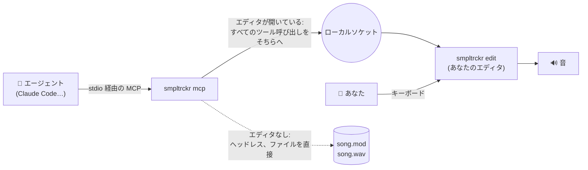
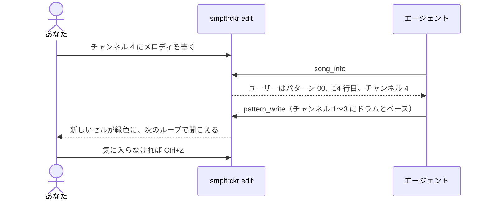
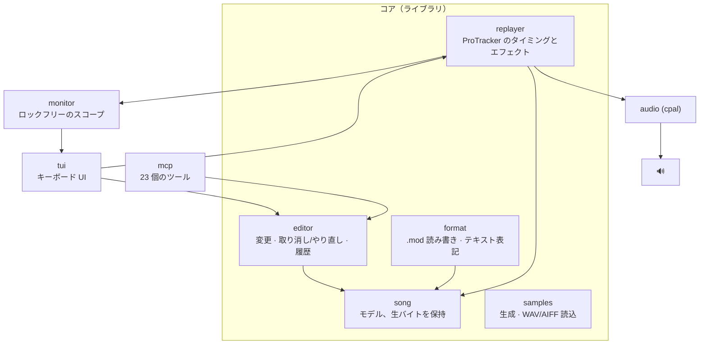

<div align="center">

```
████ █   █ ████ █     █████ ████ ████ █  █ ████
█    ██ ██ █  █ █       █   █  █ █    █ █  █  █
████ █ █ █ ████ █       █   ████ █    ██   ████
   █ █   █ █    █       █   █ █  █    █ █  █ █
████ █   █ █    ████    █   █  █ ████ █  █ █  █
```

**ターミナルで動く ProTracker 風トラッカー。手で弾くことも、AI エージェントに弾かせることもできます。**

*`.mod` をバイト単位で正確に読み書き · 独自の ProTracker リプレイヤー · 点字オシロスコープと火花 ·
エージェントが単独で、またはあなたとライブで作曲できる MCP サーバー · 日本語・英語・フランス語対応。*

[English](README.md) · [Français](README.fr.md) · 作者 [@jbheren](https://github.com/jbheren)

</div>

<p align="center"></p>

<p align="center"><em>「風の歌」を再生中。数小節のあいだチャンネル 3（琴）をソロにしています。</em> <a href="docs/media/demo-ja.mp4">▶ 音付きで見る（MP4）</a></p>

---

## 目次

- [smpltrckr とは](#smpltrckr-とは)
- [インストール](#インストール)
- [クイックスタート](#クイックスタート)
- [画面構成](#画面構成)
- [音符とエフェクトの入力](#音符とエフェクトの入力)
- [エージェントと作曲する](#エージェントと作曲する)
- [コマンドライン](#コマンドライン)
- [テキスト表記](#テキスト表記)
- [内部の仕組み](#内部の仕組み)
- [サンプル曲](#サンプル曲)
- [現状とロードマップ](#現状とロードマップ)
- [ライセンス](#ライセンス)

---

## smpltrckr とは

smpltrckr は Amiga の **ProTracker** の精神を受け継ぎ、ターミナル向けに作り直した音楽トラッカーです。
曲は **パターン** の集まりです。1 パターンは 64 行 × 4 チャンネルで、1 セルに 1 音符、上から下へ読まれます。
曲は **順番リスト** に並んだ順にパターンを再生します。

特徴：

- **`.mod` 形式に忠実。** 読み込んで保存し直したモジュールは最後の 1 バイトまで同一です
  （The Mod Archive の実際のモジュール 49 曲で確認済み）。
- **独自のリプレイヤー。** ProTracker のタイミングとエフェクトを再現し、libopenmpt とチャンネルごとに比較しています。
- **エージェントも演奏できる。** smpltrckr は [MCP](https://modelcontextprotocol.io) で 23 個のツールを公開しています。
  Claude などのエージェントが 1 曲まるごと単独で作曲することも、あなたが開いている曲に参加して
  **あなたと一緒にライブで** 作業することもできます。エージェントの変更は画面上で光って表示されます。
- **ターミナルのために。** 各チャンネルの下に点字のオシロスコープ、発音のたびに火花、
  [Omarchy](https://omarchy.org) のテーマから取った配色、キー配列対応（QWERTY、AZERTY、QWERTZ）。

---

## インストール

### ビルド済みバイナリ（Linux x86_64 と ARM64）

[最新リリース](https://github.com/jbheren/smpltrckr/releases/latest) からお使いのマシン用のアーカイブを入手します：

```sh
arch=$(uname -m)        # x86_64 または aarch64
curl -LO https://github.com/jbheren/smpltrckr/releases/download/v0.1.0/smpltrckr-v0.1.0-$arch-linux.tar.gz
tar xzf smpltrckr-v0.1.0-$arch-linux.tar.gz
install -m 755 smpltrckr-v0.1.0-$arch-linux/smpltrckr ~/.local/bin/
smpltrckr edit
```

`libasound.so.2`（ALSA）が必要です。PipeWire や PulseAudio の環境も含め、ほぼすべての Linux に入っています。

### ソースから

[Rust](https://rustup.rs)（stable）と ALSA の開発用ファイルが必要です：

| ディストリビューション | コマンド |
|---|---|
| Debian、Ubuntu | `sudo apt install libasound2-dev pkg-config` |
| Fedora | `sudo dnf install alsa-lib-devel pkgconf` |
| Arch、Omarchy | `sudo pacman -S alsa-lib pkgconf` |

```sh
git clone https://github.com/jbheren/smpltrckr
cd smpltrckr
cargo install --path .      # `smpltrckr` を ~/.cargo/bin に入れます
```

> **macOS** でも動くはずです（音は CoreAudio 経由）が、まだ試していません。
> Windows は今のところ非対応です。

---

## クイックスタート

```sh
smpltrckr edit my-song.mod          # 曲を開く（または新しく始める）
smpltrckr play song.mod             # 聴くだけ
smpltrckr render song.mod -o song.wav
```

エディタでは：

1. **F7** のあと **g**：音を生成（`square` を選ぶ）、**Enter**。
2. **F5** でパターンに戻り、**Space** で編集モード（枠が赤くなります）。
3. キーボードの下段で音符を弾きます：QWERTY なら `z x c v b n m`、AZERTY なら `w x c v b n ,`。
4. **Ctrl+P** でパターンをループ、**Esc** で停止、**Ctrl+S** で保存。
5. **?** ですべてのキー、ヘルプ内で **Tab** を押すとすべてのエフェクトを表示します。

---

## 画面構成

（`--lang ja` では画面の文字も日本語になります。下の図は英語表示の例です。）

```
 SMPLTRCKR  Kaze no Uta kaze-no-uta.mod  ▶  listen   octave 2  sample 01 taiko  QWERTY  speed 6 · 100 BPM  ① header
┌ pattern 00 ───────────────────────────────────────────────────── pos 00/04 ┐┌ orders (F6) ─────────────────┐  ② pattern  ⑥ orders
│   │ voice 1         │ voice 2         │ voice 3         │ voice 4          ││ 00  pattern               00 │  ③ voices
│02 │ ... .. ...      │ ... .. ...      │ ... .. A04      │ ... .. ...       ││ 01  pattern               01 │
│03 │ ... .. ...      │ ... .. ...      │ ... .. A04      │ ... .. ...       ││ 02  pattern               02 │
│04 │ ... .. ...      │ ... .. ...      │ F-2 03 ...      │ ... .. ...       ││ 03  pattern               01 │
│05 │ ... .. ...      │ ... .. ...      │ ... .. A04      │ ... .. ...       ││ 04  pattern               03 │
│06 │ ... .. ...      │ ... .. ...      │ ... .. A04      │ ... .. ...       ││                              │
│07 │ ... .. ...      │ ... .. ...      │ ... .. A04      │ ... .. ...       ││                              │
│08 │ ... .. ...      │ ... .. ...      │ A-2 03 ...      │ ... .. ...       ││                              │
│09 │ ... .. ...      │ ... .. ...      │ ... .. A04      │ ... .. ...       │└──────────────────────────────┘
│10 │ ... .. ...      │ ... .. ...      │ ... .. A04      │ ... .. ...       │┌ samples (F7) ────────────────┐  ⑦ samples
│11 │ ... .. ...      │ ... .. ...      │ ... .. A04      │ ... .. ...       ││ 01  taiko                 64 │
│12 │ ... .. ...      │ ... .. ...      │ B-2 03 ...      │ ... .. ...       ││ 02  hyoshigi              48 │
│13 │ ... .. ...      │ ... .. ...      │ ... .. A04      │ ... .. ...       ││ 03  koto                  44 │
│   │                 │                 │⣧⢸⡆⣶⢰⡆⣶⢰⡇⣼⢠⡇⣸⢀⡇⢰ │                  ││                              │  ④ scopes + sparks   ⑧ master
│   │                 │                 │⣿⢸⡇⣿⢸⡇⣿⢸⡇⣿⢸⡇⣿⣸⣇⡿ │                  ││⡶⡄⢀⡶⡄⢀⣶⡀⢠⢶⡀⣠⢦ ⣰⢦ ⡴⣆ ⡴⣄⢀⡶⡄⢀⣶⡀⢠⢶│
│   │⠉⠉⠉⠉⠉⠉⠉⠉⠉⠉⠉⠉⠉⠉⠉⠉ │⠉⠉⠉⠉⠉⠉⠉⠉⠉⠉⠉⠉⠉⠉⠉⠉ │⢸⡏⣷⢻⡞⢧⠿⡼⢳⡏⣿⢹⡇⣿⢸⡇ │⠉⠉⠉⠉⠉⠉⠉⠉⠉⠉⠉⠉⠉⠉⠉⠉  ││ ⠹⠞ ⠹⠞ ⠳⠏ ⠳⠃⠈⠷⠃⠈⠿⠁⠘⠾⠁⠘⠞ ⠹⠞ ⠹⠏ │
│   │                 │                 │⠈⡇⢹ ⠇⠸ ⠇⢸ ⡇⢸⠁⡏⢸⠃ │                  ││                              │
│   │ 100 %           │ 100 %           │ 100 %           │ 100 %            ││██████▏·······················│  ⑤ mix state
└────────────────────────────────────────────────────────────────────────────┘└──────────────────────────────┘
Space edit  Enter play  Ctrl+P loop  Ctrl+B tempo  Alt+1…8 mute  Alt+S solo  Alt+0 unmute all  F6 orders  ⑨ key hints
F7 samples  Ctrl+S save  ? help
? : help                                                                                              @jbheren  ⑩ status · author
```

| | エリア | 表示内容 |
|---|---|---|
| ① | **ヘッダー** | 曲のタイトルとファイル（`*` = 未保存）、再生状態 ▶ / ■、**編集** または試聴モード、エージェント接続時の **エージェント** バッジ、オクターブと現在のサンプル、キー配列、スピードとテンポ。 |
| ② | **パターン** | 編集中のパターン。ProTracker と同じくカーソル行は中央に固定され、再生中の行が強調されます。右上に順番リスト内の位置。編集モードでは枠が赤くなります。 |
| ③ | **チャンネル** | チャンネルごとに 1 列、全 4 列。各セルは *音符 · サンプル · エフェクト* の順です（下記参照）。 |
| ④ | **スコープ** | 各チャンネルの波形を点字で表示し、発音のたびに火花が飛びます。 |
| ⑤ | **ミックス状態** | 各チャンネルの音量と、該当する場合は **ミュート** または **ソロ**。ミュート中のチャンネルは灰色になります。 |
| ⑥ | **順番リスト**（F6） | 曲の各ポジションでどのパターンを再生するか。 |
| ⑦ | **サンプル**（F7） | 31 個のサンプル枠とその音量。 |
| ⑧ | **マスター** | 最終ミックス：スコープとレベルメーター。 |
| ⑨ | **キーのヒント** | 現在のエリアで使えるキー。エフェクト列では、カーソル位置のエフェクトをわかりやすく説明します。 |
| ⑩ | **ステータス** | 直前の出来事（保存、取り消し、エージェントの最後の操作…）と作者。 |

Omarchy のテーマがあれば配色はそれに従い、テーマを変えると追従します。`--theme classic` で
ターミナル標準の色のままにできます。

### セルの読み方

```
 C-3 01 A04
 └┬┘ └┤ │└┴── パラメータ：16 進 2 桁（00〜FF）
  │   │ └──── エフェクト：16 進 1 桁（0〜F）
  │   └────── サンプル：01〜31、10 進（.. = チャンネルのサンプルをそのまま）
  └────────── 音符：C-1〜B-3、シャープは #（C#2）（... = 新しい音符なし）
```

音符は、同じチャンネルの次の音符か、サンプルの終わりまで鳴り続けます。

### エリアとフォーカス

```
          F5                    F6                    F7
   ┌──────────────┐     ┌──────────────┐     ┌──────────────┐
   │   パターン   │     │  順番リスト  │     │   サンプル   │
   │ 音符、編集   │     │ ← → パターン │     │ g 生成       │
   │ Space = 編集 │     │ Ins / Del    │     │ l WAV 読込   │
   └──────────────┘     └──────────────┘     └──────────────┘
      矢印、PgUp/PgDn、Home/End で現在のエリア内を移動
```

---

## 音符とエフェクトの入力

### ピアノ鍵盤

音符は、キー配列にかかわらず ProTracker や FastTracker 2 と同じ **物理的な位置** にあります。
下の 2 段が選択中のオクターブ、上の 2 段がその 1 オクターブ上を鳴らします。
キー配列は自動で検出され（Hyprland、次に `localectl`）、**F3** で切り替え、`--keyboard` で指定できます。

```
 QWERTY                                    AZERTY
   S   D       G   H   J       L   ;         S   D       G   H   J       L   M     ← シャープ
 Z   X   C   V   B   N   M   ,   .   /     W   X   C   V   B   N   ,   ;   :   !   ← 幹音
 C   D   E   F   G   A   B   C   D   E     C   D   E   F   G   A   B   C   D   E

   2   3       5   6   7       9   0         é   "       (   -   è       ç   à     ← シャープ
 Q   W   E   R   T   Y   U   I   O   P     A   Z   E   R   T   Y   U   I   O   P   ← 幹音
 C   D   E   F   G   A   B   C   D   E     C   D   E   F   G   A   B   C   D   E   （オクターブ + 1）
```

- **F1 / F2** でオクターブを変更（1〜3）。B-3 より上の音は ProTracker にはありません。
- **Space** で **試聴モード**（音が鳴るだけ）と **編集モード**（音符が書き込まれる）を切り替えます。
- 弾いた音は、書き込まれた音符とまったく同じ響きで、カーソルのチャンネルで鳴ります。曲の再生中でも同じです。
- サンプル列とエフェクト列では、数字と `A`〜`F` を入力します。AZERTY では、Shift なしの数字段
  （`& é " ' (` …）も数字として扱います。

### エフェクト

カーソルをエフェクト列に置くと、最下行にカーソル位置のエフェクトの働きが実際の値付きで表示されます
（*「A04: 音量スライド：ティックごとに 4 ずつ下げる」*）。列が空なら、選べるエフェクトの一覧が出ます。
**?** のあと **Tab** ですべて表示されます。

| エフェクト | 働き | 例 |
|---|---|---|
| `0xy` | アルペジオ：ティックごとに音符、+x、+y 半音 — 一瞬で和音 | `037` マイナー、`047` メジャー |
| `1xx` / `2xx` | ティックごとに xx だけ音程を上げる / 下げる | `208` で急降下 |
| `3xx` | 書かれた音符へ速度 xx でグライド（音符は鳴り直さない） | `310` |
| `4xy` | ビブラート：速さ x、深さ y | `424` |
| `5xy` / `6xy` | グライド / ビブラート + 音量スライド | `5A0` |
| `7xy` | トレモロ | `744` |
| `9xx` | サンプルを xx × 256 バイト目から開始 | `904` |
| `Axy` | 音量スライド：+x、x = 0 なら -y（フェード） | `A04` |
| `Bxx` | 順番リストのポジション xx へジャンプ | `B00` |
| `Cxx` | 音量、16 進で 00〜40（= 0〜64） | `C20` = 半分 |
| `Dxy` | パターン終了、次のポジションの xy 行目へ | `D00` |
| `E1x` `E2x` | 微細な音程アップ / ダウン、1 回だけ | `E12` |
| `E6x` | パターンループ：`E60` で開始位置、`E6x` で x 回繰り返す | `E63` |
| `E9x` | x ティックごとにリトリガー | `E93` |
| `EAx` `EBx` | 微細な音量アップ / ダウン、1 回だけ | `EA4` |
| `ECx` | ティック x で音を切る — 短く乾いた音に | `EC3` |
| `EDx` | 音符をティック x まで遅らせる | `ED2` |
| `EEx` | 行を x 回繰り返す | `EE1` |
| `Fxx` | スピード（01〜1F）またはテンポ BPM（20〜FF）。`F00` で曲を停止 | `F7D` = 125 BPM |

**Ctrl+B** で、`Fxx` を手で書かずに曲頭のテンポとスピードを設定できます。

### すべてのキー

| キー | 操作 |
|---|---|
| **Enter** | 現在のポジションから曲を再生 / 停止 |
| **Ctrl+P** | 現在のパターンをループ再生 |
| **Esc** | 再生と試聴中の音を止める |
| **Space** | 編集モードのオン / オフ |
| **F1 / F2** | ピアノキーのオクターブ |
| **F3** | キー配列：QWERTY、AZERTY、QWERTZ |
| **[ ]** | 現在のサンプル（サンプル欄ではファインチューン） |
| **矢印、PgUp/PgDn** | 移動。**Tab / Shift+Tab**：次 / 前のチャンネル |
| **Del / Backspace** | 欄 / セル全体を消去 |
| **Ins / Ctrl+K** | チャンネル内で行を挿入 / 削除 |
| **Alt+1 … Alt+8** | チャンネルのミュート / 解除 |
| **Alt+S / Alt+0** | カーソルのチャンネルをソロ（他をミュート）/ ミックスをリセット |
| **Alt+↑ / Alt+↓** | カーソルのチャンネルの音量 |
| **F5 F6 F7** | 操作エリア：パターン、順番リスト、サンプル |
| 順番リスト：**← → Ins Del Enter** | パターン変更（最後の次へ → で新規作成）、追加、削除、編集 |
| サンプル：**← → g l n p Del** | 音量、生成、WAV/AIFF 読込、名前変更、試聴、空にする |
| **Ctrl+S / Ctrl+W / Ctrl+O** | 保存 / 名前を付けて保存 / 開く |
| **Ctrl+Z / Ctrl+Y** | 取り消し / やり直し（エージェントの変更も） |
| **Ctrl+T / Ctrl+B** | 曲のタイトル / テンポとスピード |
| **F8** | 履歴：誰が何をしたか（あなたかエージェントか） |
| **Ctrl+Q** | 終了（曲が未保存なら 2 回） |

### 音

smpltrckr は自分で音を作れるので、何もないところから始められます（**F7** のあと **g**）：

| 音 | 種類 | 弾く高さ |
|---|---|---|
| `sine` `square` `pulse` `saw` `triangle` | 1 周期をループ | C-2 ≈ 中央のド |
| `noise` | ホワイトノイズをループ | どこでも |
| `kick` `snare` `hihat` | ワンショットのドラム | C-3 |

**l** で WAV または AIFF ファイルを読み込みます（8〜32 ビット、モノラルまたはステレオ、ループはファイルから読み取り）。
ステータス行に、元の音程で鳴る音符が表示されます。

---

## エージェントと作曲する

smpltrckr は MCP サーバーを内蔵しています。[Claude Code](https://claude.com/claude-code) に追加するには：

```sh
claude mcp add smpltrckr -- smpltrckr mcp
```

（このリポジトリ内では、同梱の `.mcp.json` がビルドしたばかりのバイナリを使います。）

### ひとりで、または一緒に



- **ヘッドレス。** エディタが開いていなければ、エージェントは自分の曲とファイルで作業します。短い指示
  （*「イ短調の 30 秒のチップチューン」*）を出すと、サンプルを作り、パターンを書き、順番を決め、
  WAV を書き出して `.mod` を保存します。
- **ライブ。** エディタが開いていれば、エージェントは **あなたの** 曲で、あなたと一緒に作業します。
  あなたのカーソル位置が見え、変更はすぐに表示され（20 秒間緑色で強調）、次のループで聞こえます。
  **F8** で誰が何をしたかがわかります。未保存の変更があるあいだは曲を置き換えられず、
  **Ctrl+Z** でエージェントの変更もあなたのものと同じように取り消せます。
- エージェントは **呼び出しのたびに** モードを選びます。後から開いたエディタにも参加し、
  エディタを閉じるとヘッドレスに戻ります。



### ツール

| グループ | ツール |
|---|---|
| 曲 | `song_new` `song_load` `song_save` `song_info` `song_set_title` `song_set_tempo` |
| パターン | `pattern_get` `pattern_write` `pattern_clear` `pattern_copy` `pattern_transpose` `order_set` |
| サンプル | `sample_list` `sample_generate` `sample_load` `sample_set` |
| 音 | `mix_set` `render_wav` |
| 履歴 | `undo` `redo` `history` |
| ヘルプ | `ping`（ヘッドレスかライブか）`reference`（ガイド、エフェクト、音符、音階、和音） |

インターフェースの言語にかかわらず、エージェント側は常に英語でやりとりします。

---

## コマンドライン

```
smpltrckr [--lang en|fr|ja] <command>

  edit [FILE] [--keyboard qwerty|azerty|qwertz] [--theme omarchy|classic]
                        エディタ（ファイルは最初の保存時に作成）
  play FILE [--mute 2,4] [--solo 1] [--volume 3=0.5] [--separation 0.5]
                        モジュールを最後まで再生
  render FILE -o OUT.wav [--stems] [--rate 48000] [ミックスのオプション]
                        16 ビット WAV、ステレオ。--stems ならチャンネルごとにモノラルのファイル
  dump FILE [-p N]      モジュールをテキストで表示（ヘッダー、順番、サンプル、パターン）
  roundtrip FILE…       読み込み + 保存でまったく同じバイト列に戻るか確認
  mcp                   エージェント用の MCP サーバー
  tone                  音のチェック：オーディオ出力のレイテンシと音切れ
```

| 設定 | 環境変数 |
|---|---|
| 言語 | `SMPLTRCKR_LANG=ja`（既定：システムのロケール） |
| キー配列 | `SMPLTRCKR_KEYBOARD=azerty` |
| ライブ用ソケット | `SMPLTRCKR_SOCKET=/path/to.sock`（既定：`$XDG_RUNTIME_DIR/smpltrckr.sock`） |

---

## テキスト表記

パターンはプレーンテキストの言語としても書けます。エージェントが読み書きし、`dump` が出力する形式です：

```
# pattern 00
00 | C-3 01 ... | C-3 03 C18 | A-1 04 ... | A-2 06 037
01 | ... .. ... | ... .. ... | ... .. ... | ... .. 037
02 | ... .. ... | C-3 03 ... | A-2 04 ... | ... .. 037
```

1 行につき 1 行：行番号のあとにチャンネルごとのセル。他のトラッカーが書くことのあるオクターブ 0 と 4 は
表示はされますが書き込めません。不明なピリオドは `???` と表示されます。

---

## 内部の仕組み



- **舵を握る手はひとつ。** 曲を所有するのはエディタのループです。キーボードもエージェントも同じ
  変更レイヤーを通り、エージェントの要求は 2 フレームのあいだにジョブとして実行されます。
- **リプレイヤー** は ProTracker に従います：ピリオド、ファインチューン、エフェクト 0〜F と Ex、スピードとテンポ。
  Amiga のフィルタはエミュレートせず、クリーンな音です。オーディオ経路では一切メモリ確保をしません。
- **libopenmpt と照合済み。** 実際のモジュール 49 曲でチャンネルごとに比較し、長さが同じで
  エンベロープも一致しています（`scripts/compare-corpus.sh` を参照）。
- **多言語化** は `locales/*.yml`（英語、フランス語、日本語）にあり、ビルド時に埋め込まれます。

テストは `cargo test` で実行します。コーパスのテストにはモジュールが必要です：
`scripts/fetch-corpus.py --from-list` で The Mod Archive からダウンロードします（バージョン管理外）。

---

## サンプル曲

[`sessions/`](sessions) フォルダには smpltrckr で作った曲が、変更履歴とともに収められています：

| 曲 | 作り方 |
|---|---|
| **La Mineur Chip** | エージェントがひとりで、1 行の指示から |
| **Duo en la mineur** | 初めてのライブセッション：エージェントがドラムとベース、作者がメロディ。そのあとエージェントがグライドと対旋律を追加 |
| **風の歌**（Kaze no Uta） | 日本の *陰* 音階：太鼓、拍子木、爪弾く琴、グライドする尺八。すべて生成した音から |

```sh
smpltrckr play sessions/2026-10-03-kaze-no-uta/kaze-no-uta.mod
```

---

## 現状とロードマップ

現在動作するもの：`.mod` の読み書き、リプレイヤー、キーボードエディタ、単独およびライブのエージェント、テーマ、
3 言語。次の予定：

- macOS での動作確認。Windows はその後
- 小さなサンプルエディタ

計画の全体、決定事項、結果は [`PLAN.md`](PLAN.md)（フランス語）にあります。

---

## ライセンス

- **コード** は [GNU General Public License v3.0](LICENSE)（GPL-3.0-only）です。配布するものがソース付きで
  GPL のままである限り、使用・研究・改変・共有ができます。
  **商用ライセンス**（クローズドな製品での利用）は [@jbheren](https://github.com/jbheren) にご相談ください。
- [`sessions/`](sessions) 内の **曲** は [Creative Commons BY-NC-SA 4.0](sessions/LICENSE) です：
  作者を表示、商用利用不可、同じ条件で共有。
- **あなた自身の曲** はあなたのものです：ソフトウェアのライセンスは、それで作った音楽には適用されません。

---

<div align="center">

作者 [@jbheren](https://github.com/jbheren)。副操縦士は Claude。
*« Hissez les samples ! »*

</div>
