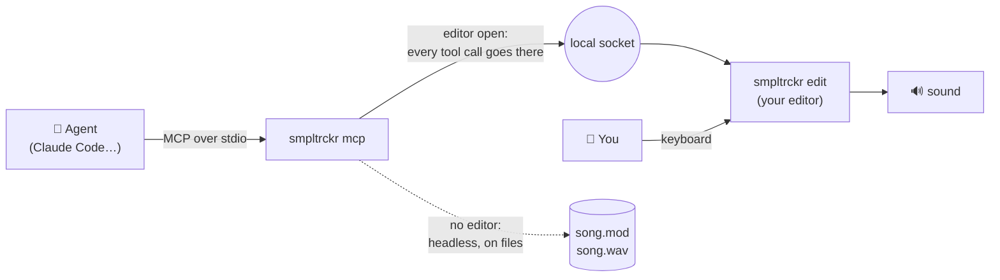
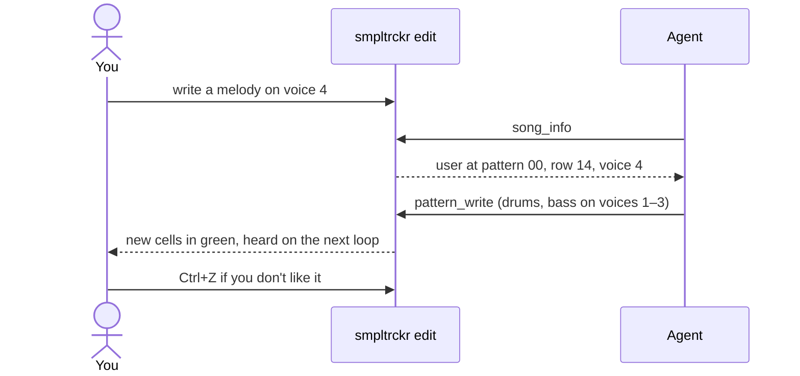
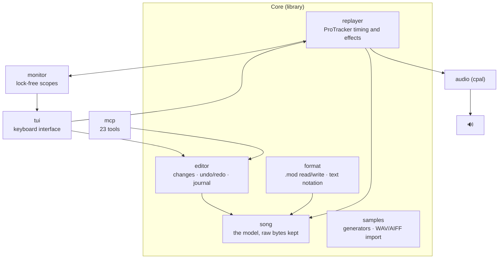

<div align="center">

```
████ █   █ ████ █     █████ ████ ████ █  █ ████
█    ██ ██ █  █ █       █   █  █ █    █ █  █  █
████ █ █ █ ████ █       █   ████ █    ██   ████
   █ █   █ █    █       █   █ █  █    █ █  █ █
████ █   █ █    ████    █   █  █ ████ █  █ █  █
```

**A ProTracker-style tracker in your terminal, played by hand or by an AI agent.**

*Reads and writes `.mod` files byte for byte · its own ProTracker replayer · braille scopes with sparks ·
an MCP server so an agent can compose, alone or live with you · English, French and Japanese.*

[Français](README.fr.md) · [日本語](README.ja.md) · by [@jbheren](https://github.com/jbheren)

</div>

<p align="center"></p>

<p align="center"><em>Kaze no Uta playing, with voice 3 (the koto) soloed for a few bars.</em> <a href="docs/media/demo-en.mp4">▶ Watch with sound (MP4)</a></p>

---

## Contents

- [What it is](#what-it-is)
- [Installation](#installation)
- [Quick start](#quick-start)
- [The interface](#the-interface)
- [Typing notes and effects](#typing-notes-and-effects)
- [Composing with an agent](#composing-with-an-agent)
- [Command line](#command-line)
- [The text notation](#the-text-notation)
- [Under the hood](#under-the-hood)
- [Example songs](#example-songs)
- [Status and roadmap](#status-and-roadmap)
- [License](#license)

---

## What it is

smpltrckr is a music tracker in the spirit of the Amiga's **ProTracker**, rebuilt for the terminal.
A song is a grid of **patterns**: 64 rows, 4 voices, one note per cell, read from top to bottom.
The song plays the patterns in the order given by the **order list**.

What makes it different:

- **The `.mod` format, faithfully.** A module loaded then saved again is identical down to the last byte
  (checked on a corpus of 49 real modules from The Mod Archive).
- **Its own replayer.** ProTracker timing and effects, compared with libopenmpt voice by voice.
- **An agent can play too.** smpltrckr exposes 23 tools over [MCP](https://modelcontextprotocol.io):
  an agent such as Claude can compose a whole song on its own, or join the song you have open and
  work on it **with you, live**. Its changes light up on your screen.
- **Made for the terminal.** Braille oscilloscopes under each voice, sparks on every attack, colours
  taken from your [Omarchy](https://omarchy.org) theme, keyboard layouts (QWERTY, AZERTY, QWERTZ).

---

## Installation

### Prebuilt binary (Linux x86_64 and ARM64)

Grab the archive for your machine from the [latest release](https://github.com/jbheren/smpltrckr/releases/latest):

```sh
arch=$(uname -m)        # x86_64 or aarch64
curl -LO https://github.com/jbheren/smpltrckr/releases/download/v0.1.0/smpltrckr-v0.1.0-$arch-linux.tar.gz
tar xzf smpltrckr-v0.1.0-$arch-linux.tar.gz
install -m 755 smpltrckr-v0.1.0-$arch-linux/smpltrckr ~/.local/bin/
smpltrckr edit
```

It needs `libasound.so.2` (ALSA), present on virtually every Linux system, PipeWire and
PulseAudio setups included.

### From source

You need [Rust](https://rustup.rs) (stable) and the ALSA development files:

| Distribution | Command |
|---|---|
| Debian, Ubuntu | `sudo apt install libasound2-dev pkg-config` |
| Fedora | `sudo dnf install alsa-lib-devel pkgconf` |
| Arch, Omarchy | `sudo pacman -S alsa-lib pkgconf` |

```sh
git clone https://github.com/jbheren/smpltrckr
cd smpltrckr
cargo install --path .      # puts `smpltrckr` in ~/.cargo/bin
```

> **macOS** should work (sound goes through CoreAudio) but has not been tested yet.
> Windows is not supported for now.

---

## Quick start

```sh
smpltrckr edit my-song.mod          # open (or start) a song
smpltrckr play song.mod             # just listen
smpltrckr render song.mod -o song.wav
```

In the editor:

1. **F7**, then **g**: generate a sound (pick `square`), **Enter**.
2. **F5** back to the pattern, **Space** for edit mode (the frame turns red).
3. Play notes on the bottom row of your keyboard: `z x c v b n m` on QWERTY, `w x c v b n ,` on AZERTY.
4. **Ctrl+P** loops the pattern, **Esc** stops, **Ctrl+S** saves.
5. **?** shows every key, **Tab** in the help shows every effect.

---

## The interface

```
 SMPLTRCKR  Kaze no Uta kaze-no-uta.mod  ▶  listen   octave 2  sample 01 taiko  QWERTY  speed 6 · 100 BPM  ① header
┌ pattern 00 ───────────────────────────────────────────────────── pos 00/04 ┐┌ orders (F6) ─────────────────┐  ② pattern  ⑥ orders
│   │ voice 1         │ voice 2         │ voice 3         │ voice 4          ││ 00  pattern               00 │  ③ voices
│02 │ ... .. ...      │ ... .. ...      │ ... .. A04      │ ... .. ...       ││ 01  pattern               01 │
│03 │ ... .. ...      │ ... .. ...      │ ... .. A04      │ ... .. ...       ││ 02  pattern               02 │
│04 │ ... .. ...      │ ... .. ...      │ F-2 03 ...      │ ... .. ...       ││ 03  pattern               01 │
│05 │ ... .. ...      │ ... .. ...      │ ... .. A04      │ ... .. ...       ││ 04  pattern               03 │
│06 │ ... .. ...      │ ... .. ...      │ ... .. A04      │ ... .. ...       ││                              │
│07 │ ... .. ...      │ ... .. ...      │ ... .. A04      │ ... .. ...       ││                              │
│08 │ ... .. ...      │ ... .. ...      │ A-2 03 ...      │ ... .. ...       ││                              │
│09 │ ... .. ...      │ ... .. ...      │ ... .. A04      │ ... .. ...       │└──────────────────────────────┘
│10 │ ... .. ...      │ ... .. ...      │ ... .. A04      │ ... .. ...       │┌ samples (F7) ────────────────┐  ⑦ samples
│11 │ ... .. ...      │ ... .. ...      │ ... .. A04      │ ... .. ...       ││ 01  taiko                 64 │
│12 │ ... .. ...      │ ... .. ...      │ B-2 03 ...      │ ... .. ...       ││ 02  hyoshigi              48 │
│13 │ ... .. ...      │ ... .. ...      │ ... .. A04      │ ... .. ...       ││ 03  koto                  44 │
│   │                 │                 │⣧⢸⡆⣶⢰⡆⣶⢰⡇⣼⢠⡇⣸⢀⡇⢰ │                  ││                              │  ④ scopes + sparks   ⑧ master
│   │                 │                 │⣿⢸⡇⣿⢸⡇⣿⢸⡇⣿⢸⡇⣿⣸⣇⡿ │                  ││⡶⡄⢀⡶⡄⢀⣶⡀⢠⢶⡀⣠⢦ ⣰⢦ ⡴⣆ ⡴⣄⢀⡶⡄⢀⣶⡀⢠⢶│
│   │⠉⠉⠉⠉⠉⠉⠉⠉⠉⠉⠉⠉⠉⠉⠉⠉ │⠉⠉⠉⠉⠉⠉⠉⠉⠉⠉⠉⠉⠉⠉⠉⠉ │⢸⡏⣷⢻⡞⢧⠿⡼⢳⡏⣿⢹⡇⣿⢸⡇ │⠉⠉⠉⠉⠉⠉⠉⠉⠉⠉⠉⠉⠉⠉⠉⠉  ││ ⠹⠞ ⠹⠞ ⠳⠏ ⠳⠃⠈⠷⠃⠈⠿⠁⠘⠾⠁⠘⠞ ⠹⠞ ⠹⠏ │
│   │                 │                 │⠈⡇⢹ ⠇⠸ ⠇⢸ ⡇⢸⠁⡏⢸⠃ │                  ││                              │
│   │ 100 %           │ 100 %           │ 100 %           │ 100 %            ││██████▏·······················│  ⑤ mix state
└────────────────────────────────────────────────────────────────────────────┘└──────────────────────────────┘
Space edit  Enter play  Ctrl+P loop  Ctrl+B tempo  Alt+1…8 mute  Alt+S solo  Alt+0 unmute all  F6 orders  ⑨ key hints
F7 samples  Ctrl+S save  ? help
? : help                                                                                              @jbheren  ⑩ status · author
```

| | Zone | What it shows |
|---|---|---|
| ① | **Header** | Song title and file (`*` = unsaved), play state ▶ / ■, **EDIT** or listen mode, an **agent** badge when an agent is connected, octave and current sample, keyboard layout, speed and tempo. |
| ② | **Pattern** | The pattern being edited. The cursor row stays in the middle, as in ProTracker; the playing row is highlighted. The position in the order list sits in the top-right corner. The frame turns red in edit mode. |
| ③ | **Voices** | Four columns, one per voice. Each cell reads *note · sample · effect* (see below). |
| ④ | **Scopes** | The waveform of each voice in braille dots, with sparks thrown off on every attack. |
| ⑤ | **Mix state** | Volume of each voice, and **muted** or **SOLO** when it applies. A muted voice turns grey. |
| ⑥ | **Order list** (F6) | Which pattern plays at each position of the song. |
| ⑦ | **Samples** (F7) | The 31 sample slots, with their volume. |
| ⑧ | **Master** | The final mix: scope and level meter. |
| ⑨ | **Key hints** | The useful keys of the active zone. On an effect column, the effect under the cursor, in plain words. |
| ⑩ | **Status** | What just happened (save, undo, the agent's last move…), and the author. |

The colours follow your Omarchy theme when there is one (and change with it); `--theme classic`
keeps plain terminal colours.

### Anatomy of a cell

```
 C-3 01 A04
 └┬┘ └┤ │└┴── parameter: 2 hex digits (00 to FF)
  │   │ └──── effect: 1 hex digit (0 to F)
  │   └────── sample: 01 to 31, in decimal  (.. = keep the voice's sample)
  └────────── note: C-1 to B-3, # for sharps (C#2)  (... = no new note)
```

A note keeps ringing until the next note on the same voice, or the end of the sample.

### Zones and focus

```
          F5                    F6                    F7
   ┌──────────────┐     ┌──────────────┐     ┌──────────────┐
   │   pattern    │     │  order list  │     │   samples    │
   │ notes, edits │     │ ← → pattern  │     │ g generate   │
   │ Space = edit │     │ Ins / Del    │     │ l load WAV   │
   └──────────────┘     └──────────────┘     └──────────────┘
         the arrows, PgUp/PgDn, Home/End move inside the active zone
```

---

## Typing notes and effects

### The piano keyboard

Notes sit at the same **physical** places as in ProTracker and FastTracker 2, whatever your layout:
the two bottom rows play the chosen octave, the two top rows the octave above.
The layout is detected (Hyprland, then `localectl`); **F3** switches it, `--keyboard` forces it.

```
 QWERTY                                    AZERTY
   S   D       G   H   J       L   ;         S   D       G   H   J       L   M     ← sharps
 Z   X   C   V   B   N   M   ,   .   /     W   X   C   V   B   N   ,   ;   :   !   ← naturals
 C   D   E   F   G   A   B   C   D   E     C   D   E   F   G   A   B   C   D   E

   2   3       5   6   7       9   0         é   "       (   -   è       ç   à     ← sharps
 Q   W   E   R   T   Y   U   I   O   P     A   Z   E   R   T   Y   U   I   O   P   ← naturals
 C   D   E   F   G   A   B   C   D   E     C   D   E   F   G   A   B   C   D   E   (octave + 1)
```

- **F1 / F2** change the octave (1 to 3). Notes above B-3 do not exist in ProTracker.
- **Space** switches between **listen mode** (notes only sound) and **edit mode** (notes are written).
- Playing a note sounds exactly like the written note will, on the cursor's voice, even while the song plays.
- In the sample and effect columns, digits and `A`–`F` are typed in. On AZERTY, the unshifted digit
  row (`& é " ' (` …) counts as digits.

### Effects

Put the cursor on an effect column: the bottom line tells what the effect under the cursor does,
with its actual values (*"A04: volume slide: down by 4 per tick"*), or lists the effects to pick
from when the column is empty. **?** then **Tab** shows them all.

| Effect | What it does | Example |
|---|---|---|
| `0xy` | Arpeggio: note, +x, +y semitones on every tick — instant chords | `037` minor, `047` major |
| `1xx` / `2xx` | Pitch slides up / down by xx per tick | `208` dives |
| `3xx` | Glide to the written note at speed xx (the note does not restart) | `310` |
| `4xy` | Vibrato: speed x, depth y | `424` |
| `5xy` / `6xy` | Glide / vibrato + volume slide | `5A0` |
| `7xy` | Tremolo | `744` |
| `9xx` | Start the sample at xx × 256 bytes | `904` |
| `Axy` | Volume slide: +x, or -y when x = 0 (fades) | `A04` |
| `Bxx` | Jump to position xx of the order list | `B00` |
| `Cxx` | Volume, 00 to 40 in hex (= 0 to 64) | `C20` = half |
| `Dxy` | End of pattern, go to row xy of the next position | `D00` |
| `E1x` `E2x` | Fine pitch up / down, once | `E12` |
| `E6x` | Pattern loop: `E60` marks the start, `E6x` plays it again x times | `E63` |
| `E9x` | Retrigger every x ticks | `E93` |
| `EAx` `EBx` | Fine volume up / down, once | `EA4` |
| `ECx` | Cut the note at tick x — short, dry notes | `EC3` |
| `EDx` | Delay the note to tick x | `ED2` |
| `EEx` | Repeat the row x times | `EE1` |
| `Fxx` | Speed (01–1F) or tempo in BPM (20–FF); `F00` stops the song | `F7D` = 125 BPM |

**Ctrl+B** sets the tempo and speed at the start of the song without typing `Fxx` by hand.

### All keys

| Keys | Action |
|---|---|
| **Enter** | play / stop the song from the current position |
| **Ctrl+P** | loop the current pattern |
| **Esc** | stop playback and the notes being listened to |
| **Space** | edit mode on / off |
| **F1 / F2** | octave of the piano keys |
| **F3** | keyboard layout: QWERTY, AZERTY, QWERTZ |
| **[ ]** | current sample (in the samples panel: finetune) |
| **arrows, PgUp/PgDn** | move; **Tab / Shift+Tab**: next / previous voice |
| **Del / Backspace** | clear the field / the whole cell |
| **Ins / Ctrl+K** | insert / delete a row in the voice |
| **Alt+1 … Alt+8** | mute / unmute a voice |
| **Alt+S / Alt+0** | solo the cursor voice (mutes the others) / reset the mix |
| **Alt+↑ / Alt+↓** | volume of the cursor voice |
| **F5 F6 F7** | active zone: pattern, order list, samples |
| order list: **← → Ins Del Enter** | change the pattern (→ past the last one creates it), add, remove, edit |
| samples: **← → g l n p Del** | volume, generate, load WAV/AIFF, rename, listen, clear |
| **Ctrl+S / Ctrl+W / Ctrl+O** | save / save as / open |
| **Ctrl+Z / Ctrl+Y** | undo / redo (the agent's changes too) |
| **Ctrl+T / Ctrl+B** | song title / tempo and speed |
| **F8** | journal: who did what, you or the agent |
| **Ctrl+Q** | quit (twice if the song is not saved) |

### Sounds

smpltrckr makes its own sounds, so you can start from nothing (**F7**, then **g**):

| Sound | Kind | Play it at |
|---|---|---|
| `sine` `square` `pulse` `saw` `triangle` | one looped cycle | C-2 ≈ middle C |
| `noise` | looped white noise | anywhere |
| `kick` `snare` `hihat` | one-shot drums | C-3 |

**l** loads a WAV or AIFF file (8 to 32 bits, mono or stereo, loops read from the file). The status line
tells which note plays it at its original pitch.

---

## Composing with an agent

smpltrckr includes an MCP server. Add it to [Claude Code](https://claude.com/claude-code):

```sh
claude mcp add smpltrckr -- smpltrckr mcp
```

(or, inside this repository, the provided `.mcp.json` uses the freshly built binary).

### Alone or together



- **Headless.** No editor open: the agent works on its own song and files. Give it a short brief
  (*"a 30-second chiptune in A minor"*) and it creates the samples, writes the patterns, sets the
  order, renders a WAV and saves the `.mod`.
- **Live.** An editor is open: the agent works on **your** song, with you. It sees where your cursor
  is, its changes show up at once (highlighted in green for 20 s), you hear them on the next loop,
  and **F8** shows who did what. It cannot replace your song while you have unsaved changes, and
  **Ctrl+Z** undoes its changes like yours.
- The agent picks the mode on **every call**: it joins an editor opened after it, and falls back to
  headless when you close it.



### The tools

| Group | Tools |
|---|---|
| Song | `song_new` `song_load` `song_save` `song_info` `song_set_title` `song_set_tempo` |
| Patterns | `pattern_get` `pattern_write` `pattern_clear` `pattern_copy` `pattern_transpose` `order_set` |
| Samples | `sample_list` `sample_generate` `sample_load` `sample_set` |
| Sound | `mix_set` `render_wav` |
| History | `undo` `redo` `history` |
| Help | `ping` (headless or live?) `reference` (guide, effects, notes, scales, chords) |

The agent side always speaks English, whatever your interface language.

---

## Command line

```
smpltrckr [--lang en|fr|ja] <command>

  edit [FILE] [--keyboard qwerty|azerty|qwertz] [--theme omarchy|classic]
                        the editor (the file is created on first save)
  play FILE [--mute 2,4] [--solo 1] [--volume 3=0.5] [--separation 0.5]
                        play a module until its end
  render FILE -o OUT.wav [--stems] [--rate 48000] [mix options]
                        16-bit WAV, stereo, or one mono file per voice with --stems
  dump FILE [-p N]      print a module as text (header, orders, samples, patterns)
  roundtrip FILE…       check that load + save gives back the very same bytes
  mcp                   the MCP server for agents
  tone                  sound check: latency and dropouts of your audio output
```

| Setting | Environment variable |
|---|---|
| language | `SMPLTRCKR_LANG=fr` (default: the system locale) |
| keyboard layout | `SMPLTRCKR_KEYBOARD=azerty` |
| live socket | `SMPLTRCKR_SOCKET=/path/to.sock` (default: `$XDG_RUNTIME_DIR/smpltrckr.sock`) |

---

## The text notation

Patterns are also a plain-text language — what the agent reads and writes, and what `dump` prints:

```
# pattern 00
00 | C-3 01 ... | C-3 03 C18 | A-1 04 ... | A-2 06 037
01 | ... .. ... | ... .. ... | ... .. ... | ... .. 037
02 | ... .. ... | C-3 03 ... | A-2 04 ... | ... .. 037
```

One row per line: row number, then one cell per voice. Octaves 0 and 4, written by some other
trackers, are shown but not written; an unknown period shows as `???`.

---

## Under the hood



- **One hand on the helm.** The editor loop owns the song. Keyboard and agent both go through the
  same change layer; the agent's requests are run as jobs between two frames.
- **The replayer** follows ProTracker: periods, finetune, effects 0–F and Ex, speed and tempo. No
  Amiga filter emulation — clean sound. Nothing is allocated on the audio path.
- **Checked against libopenmpt** on 49 real modules, voice by voice: same durations, envelopes that
  match (see `scripts/compare-corpus.sh`).
- **Localisation** lives in `locales/*.yml` (English, French, Japanese), embedded at build time.

Run the tests with `cargo test`. The corpus test needs the modules:
`scripts/fetch-corpus.py --from-list` downloads them from The Mod Archive (not versioned).

---

## Example songs

The [`sessions/`](sessions) folder keeps songs made with smpltrckr, with their change journals:

| Song | How it was made |
|---|---|
| **La Mineur Chip** | the agent alone, from a one-line brief |
| **Duo en la mineur** | the first live session: the agent on drums and bass, the author on the melody, then glides and a counter-melody from the agent |
| **Kaze no Uta** (風の歌) | Japanese *in* scale: taiko, hyoshigi, plucked koto and a gliding shakuhachi, all from generated sounds |

```sh
smpltrckr play sessions/2026-10-03-kaze-no-uta/kaze-no-uta.mod
```

---

## Status and roadmap

Working today: `.mod` reading and writing, replayer, keyboard editor, solo and live agent, themes,
three languages. Next:

- macOS testing; Windows later;
- a small sample editor.

The full plan, decisions and results are in [`PLAN.md`](PLAN.md) (in French).

---

## License

- **The code** is under the [GNU General Public License v3.0](LICENSE) (GPL-3.0-only): use it, study it,
  change it and share it, as long as what you distribute stays under the GPL with its source.
  **Commercial licensing** (for use in closed products) is available on request from
  [@jbheren](https://github.com/jbheren).
- **The songs** in [`sessions/`](sessions) are under
  [Creative Commons BY-NC-SA 4.0](sessions/LICENSE): credit the author, no commercial use,
  share alike.
- **Your own songs** are yours: the license of the software does not apply to the music you make with it.

---

<div align="center">

Made by [@jbheren](https://github.com/jbheren), with Claude as a co-pilot.
*« Hissez les samples ! »*

</div>
